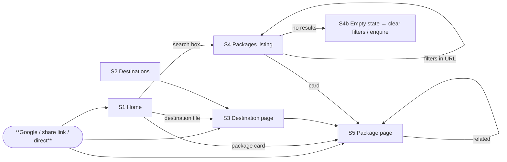
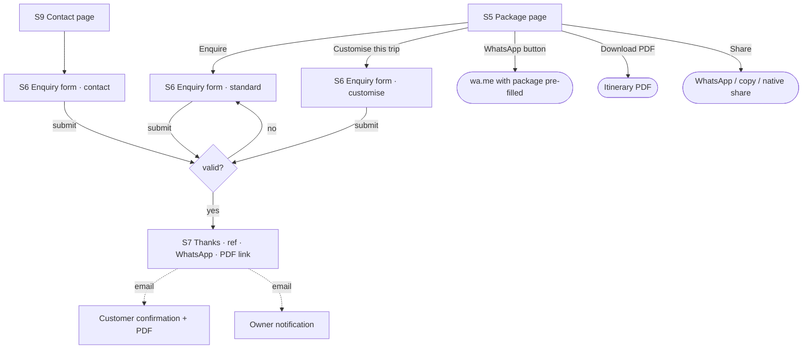
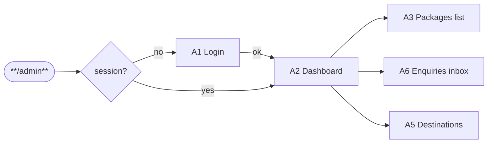
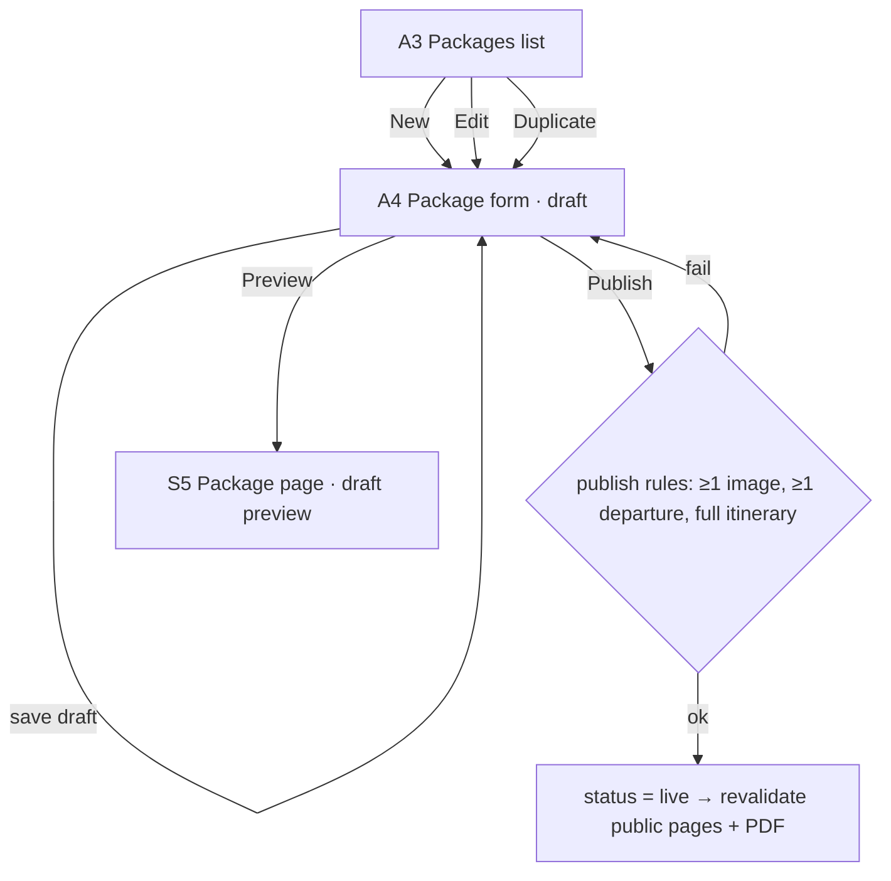
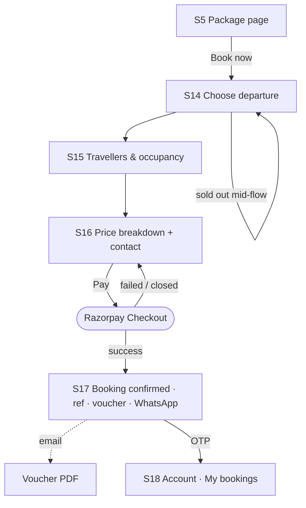
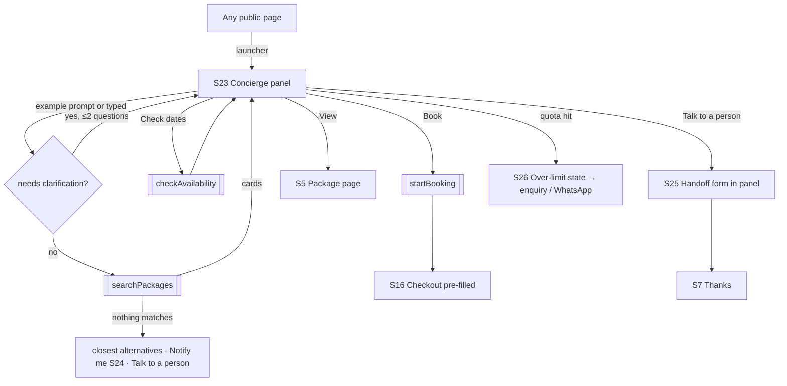
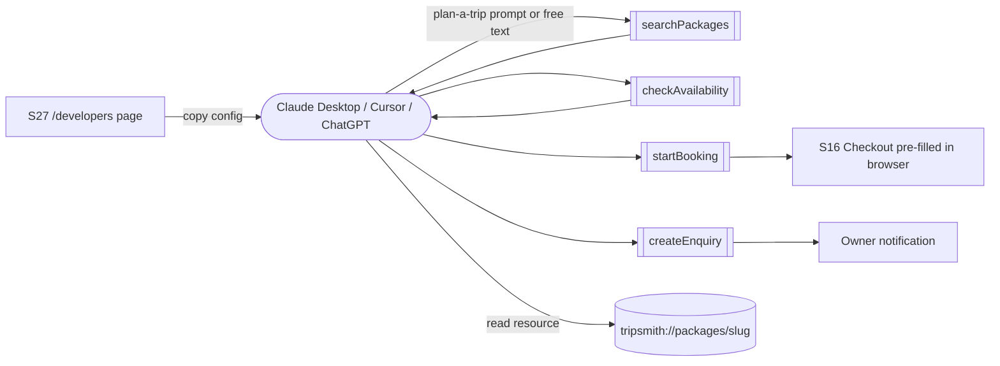

# Tripsmith — User Flows (v1–v4)

**Lifecycle step:** 3 of 17 (UX companion to the requirements) · **Written:** 2026-09-12
**Inputs:** [03-requirements.md](03-requirements.md), [-v2](03-requirements-v2.md), [-v3](03-requirements-v3.md), [-v4](03-requirements-v4.md)
**Pairs with:** [04-ui-mockups.md](04-ui-mockups.md) (one mockup per screen named here)

Every flow names its screens; every screen appears in the mockup index. Entry points are in **bold**; the "happy path" is the left-most path; dead ends always offer a next step.

---

## Visitor flows (v1)

### F1. Discover → package (the main path)


### F2. Enquire (conversion)


### F3. Search box on Home
```
S1 Home search (destination · budget · nights) → submit → S4 /packages?destination=&maxBudget=&nights= → results
```

### F4. Info & trust
```
Footer / nav → S8 About · S9 Contact · S10 Terms · S11 Privacy · S12 Cancellation policy · 404 (S13)
```

## Owner flows (v1)

### F5. Login & dashboard


### F6. Create / edit a package


### F7. Work an enquiry
```
A6 Inbox (filter new) → A7 Enquiry detail → call / WhatsApp / mailto → status: contacted → note → status: converted | closed → CSV export
```

---

## Customer flows (v2)

### F8. Book now


### F9. Account
```
Email OTP (S19) → S18 My bookings → S20 Booking detail (voucher, request cancellation S21) → S22 Review (only when completed)
```

### F10. Owner: bookings desk
```
A2 Dashboard → A8 Bookings list → A9 Booking detail (payment timeline, mark paid offline, resolve cancellation) → A10 Departure manifest
A7 Enquiry detail → reply (A11 thread)
A4 Package form → deals fields · A12 Reviews moderation
```

---

## Concierge flows (v3)

### F11. Chat → cards → book or handoff


### F12. Owner: conversation log
```
A2 Dashboard (tiles) → A13 Conversations list → A14 Conversation detail (transcript + tool calls)
A4 Package form → "Draft with AI" (add-on A) → form pre-filled as draft
```

---

## MCP client flows (v4)

### F13. Install and plan from an assistant


---

## Screen index (drives the mockups)
| ID | Screen | Version |
|---|---|---|
| S1 | Home | v1 |
| S2 | Destinations grid | v1 |
| S3 | Destination page | v1 |
| S4 / S4b | Packages listing / empty state | v1 |
| S5 | Package page (incl. sticky mobile CTA bar) | v1 |
| S6 | Enquiry form (standard / customise / contact) | v1 |
| S7 | Thanks | v1 |
| S8–S12 | About · Contact · Terms · Privacy · Cancellation policy | v1 |
| S13 | 404 | v1 |
| A1–A7 | Login · Dashboard · Packages list · Package form · Destinations · Enquiries inbox · Enquiry detail | v1 |
| S14–S17 | Choose departure · Travellers · Breakdown + contact · Confirmed | v2 |
| S18–S22 | My bookings · OTP login · Booking detail · Cancellation request · Review | v2 |
| A8–A12 | Bookings list · Booking detail · Manifest · Enquiry reply thread · Reviews moderation | v2 |
| S23–S26 | Concierge panel · Notify me · Handoff form · Over-limit | v3 |
| A13–A14 | Conversations list · Conversation detail | v3 |
| S27 | /developers | v4 |
