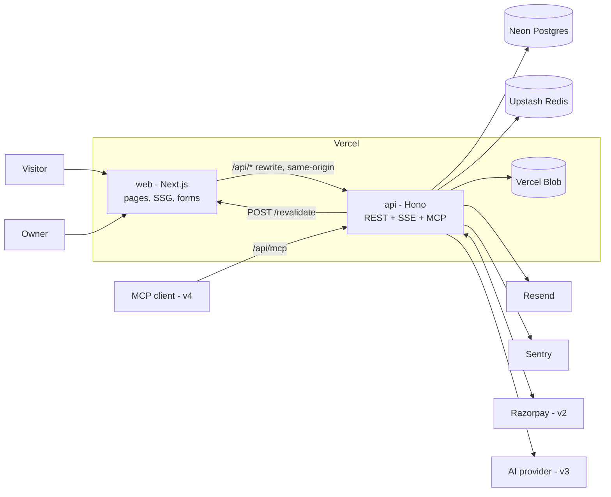
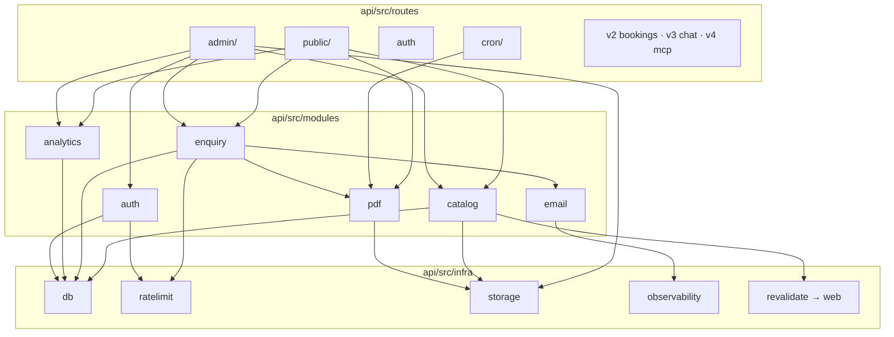
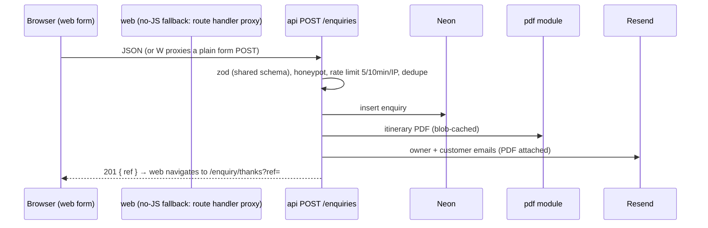

# Tripsmith — Architecture

**Lifecycle step:** 5 of 17 · **Written:** 2026-09-12 · **Revised:** 2026-09-12 for the separate `web/` + `api/` layout
**Inputs:** [04-technical-design.md](04-technical-design.md), [04-technical-design-v2-v3.md](04-technical-design-v2-v3.md)
**Scope:** the whole product; v2/v3/v4 seams marked.

## 0. The split (applies to all six portfolio projects)
Two deployables in one repo, one language, shared types:

| Folder | What | Owns | Deployed as |
|---|---|---|---|
| **`web/`** | Next.js App Router — UI only | pages, components, SEO, forms (as thin clients), static generation | Vercel project `tripsmith` → `tripsmith.virajdomadia.com` |
| **`api/`** | Hono (TypeScript) REST API | database, auth, business logic, PDF, email, uploads, payments, AI, MCP, crons, webhooks | Vercel project `tripsmith-api` (Hono on Vercel functions) → `api.tripsmith.virajdomadia.com` |
| **`shared/`** | `@tripsmith/shared` workspace package | zod schemas, TS types, constants (themes, enums, limits) | published to neither — imported by both |

`web/` **never** imports Drizzle or touches the database. It talks to `api/` over HTTP through a same-origin rewrite (`/api/*` → the API deployment), so cookies are first-party and there is no CORS. Everything designed in steps 4 and 6 as a "server action" becomes an API endpoint; `web/` keeps only trivial route handlers (revalidation hook, OG images, sitemap).

## 1. System context


## 2. Repo layout (pnpm workspaces)
```
tripsmith/
├─ web/                              Next.js
│  ├─ app/
│  │  ├─ (site)/                     home, destinations/, packages/, about/, contact/, enquiry/thanks, policies
│  │  ├─ (admin)/admin/              login/, dashboard, destinations/, packages/, enquiries/  (v2: bookings/, v3: conversations/)
│  │  ├─ (account)/account/          v2
│  │  ├─ developers/                 v4
│  │  ├─ revalidate/route.ts         POST from api with secret → revalidateTag/Path
│  │  ├─ sitemap.ts · robots.ts · opengraph-image routes
│  ├─ components/  ui/ · site/ · admin/ · seo/ · concierge/ (v3)
│  ├─ lib/  api-client.ts (typed fetch, cookies forwarded) · auth-client.ts (Better Auth client) · seo/
│  ├─ tests/e2e/                     Playwright
│  └─ next.config.ts                 rewrites: /api/:path* → API_URL/:path*
├─ api/                              Hono
│  ├─ src/
│  │  ├─ app.ts                      Hono app: middleware (logger, sentry, rate limit, auth session), routes mounted
│  │  ├─ index.ts                    Vercel handler (hono/vercel); local dev via @hono/node-server
│  │  ├─ routes/
│  │  │  ├─ public/                  catalog.ts, enquiries.ts, pdf.ts, views.ts
│  │  │  ├─ admin/                   destinations.ts, packages.ts, images.ts, enquiries.ts, dashboard.ts
│  │  │  ├─ auth.ts                  Better Auth handler mounted at /auth/*
│  │  │  ├─ cron/                    pdf-gc.ts (v3: departure-alerts, v2 add-on: share-reminders)
│  │  │  ├─ account/ · bookings.ts · webhooks/razorpay.ts     v2
│  │  │  ├─ chat.ts (SSE) · alerts.ts                          v3
│  │  │  └─ mcp.ts                                             v4
│  │  ├─ modules/                    catalog/ enquiry/ pdf/ email/ auth/ analytics/ seo-markdown/  (v2 booking/ payments/, v3 ai/, v4 mcp/)
│  │  ├─ infra/                      db/ (schema.ts, client.ts, migrations/), ratelimit.ts, storage.ts, observability.ts, revalidate.ts
│  │  └─ openapi.ts                  @hono/zod-openapi → /docs (Scalar UI) + /openapi.json
│  ├─ content/                       seed content (definePackage files)
│  ├─ scripts/seed.ts
│  ├─ tests/                         unit + route tests (vitest, app.request)
│  └─ drizzle.config.ts
├─ shared/                           @tripsmith/shared: schemas/ (zod), types/, constants/
├─ docs/ · mockups/ · brand/
├─ package.json · pnpm-workspace.yaml · turbo.json (optional)
└─ .github/workflows/                ci.yml, e2e.yml, lighthouse.yml
```

## 3. Module boundaries inside `api/`
The rule from before still holds, one level down: **routes never touch Drizzle; they call modules; modules own their tables; infra is the only place a vendor SDK is imported.**


- Modules return plain objects typed by `@tripsmith/shared` — the same types `web/` renders and the v3 tools return.
- Routes validate with the shared zod schemas via `@hono/zod-openapi`, which also generates the OpenAPI document.

## 4. Auth across the split
- **Better Auth runs in `api/`** (Hono adapter), mounted at `/auth/*`. Session cookie is set on the site origin because `web/` proxies `/api/*` → API; the browser never sees a second origin.
- `web/` uses the Better Auth **client** pointed at `/api/auth` for login/logout and a `getSession()` helper (server-side fetch forwarding cookies) in `middleware.ts` to gate `/admin/*` (v2: `/account/*`).
- `api/` enforces authorization itself on every protected route (`requireOwner`, v2 `requireUser`) — the web gate is UX only.

## 5. Key flows (revised)

### 5.1 Static package page
```
build: web generateStaticParams → GET /api/packages?status=live (slugs)
request: web page.tsx → fetch(`${API}/packages/${slug}`, { next: { tags: ['packages', `package:${slug}`] } }) → render
client: <ViewBeacon> → POST /api/views { slug }
```

### 5.2 Listing with filters
```
web /packages?… → fetch /api/packages?destination=&maxBudget=&nights=&theme=&month=&sort= (tag 'packages') → cards
FilterBar updates the URL; web re-renders; API query is the single searchPackages() implementation
```

### 5.3 Enquiry


### 5.4 Owner edits a package (revalidation across the split)
```
web admin form → PUT /api/admin/packages/:id (cookie) → api: requireOwner → tx → 200
api → POST {WEB_URL}/revalidate { secret, tags: ['packages', 'package:slug', 'destination:slug'] }
web /revalidate → revalidateTag(...) → next request rebuilds the static page
api: updatedAt changed → next itinerary.pdf request renders a fresh file
```

### 5.5 Image upload
```
web GalleryUploader → POST /api/admin/uploads/token (owner) → Blob client upload from browser → POST /api/admin/packages/:id/images { url, position }
```

### 5.6 v3 chat (SSE across the split)
```
web Concierge (useChat, api: '/api/chat') → rewrite → api POST /chat (Hono streaming, AI SDK streamText) → SSE back through the rewrite
```

### 5.7 v4 MCP
```
MCP client → POST https://api.tripsmith.virajdomadia.com/mcp (direct, no rewrite) → mcp module → same tool definitions as chat
```

## 6. Deployment topology
| Environment | web | api | Data |
|---|---|---|---|
| Local | `localhost:3000` (rewrites → `localhost:8787`) | `localhost:8787` (`@hono/node-server`) | Neon dev branch |
| Preview (step 14 staging) | Vercel preview per PR; `API_URL` = the api preview URL | Vercel preview per PR | Neon branch per PR, seeded by CI |
| Production | `tripsmith.virajdomadia.com` | `api.tripsmith.virajdomadia.com` | Neon `main` |

- Two Vercel projects from one repo (root directories `web/` and `api/`), both region `bom1`; Neon in Singapore.
- Crons live in the **api** project's `vercel.json`. Webhooks (v2) and MCP (v4) hit the api domain directly.
- Secrets split: `api/` holds all service keys; `web/` holds only `API_URL`, `REVALIDATE_SECRET`, `NEXT_PUBLIC_*`.

## 7. Cross-cutting
| Concern | Where |
|---|---|
| Validation | `shared/schemas` — one zod schema per form/endpoint, used by web forms and api routes |
| OpenAPI | generated by `@hono/zod-openapi`; served at `/docs` (Scalar) — a portfolio artifact in itself |
| Errors | api returns `{ error: { code, message, fieldErrors? } }` with proper status; web maps to inline errors; unexpected → Sentry in both |
| Caching | web `fetch` tags + `/revalidate` hook; api sets `Cache-Control` on public GETs |
| Rate limiting | api `infra/ratelimit` (Upstash) as Hono middleware per route |
| Observability | Sentry in both projects; Vercel Analytics on web; UptimeRobot on `/` and `/api/health` |
| Content | `api/content/` seed files; DB is the runtime source of truth |

## 8. v2 / v3 / v4 seams
| Later piece | Slots into |
|---|---|
| v2 `modules/booking`, `modules/payments`, routes `account/`, `bookings.ts`, `webhooks/razorpay.ts` | api only; web adds `(account)` pages and the checkout UI calling the endpoints |
| v3 `modules/ai` (provider, tools, guardrails), `routes/chat.ts` (SSE) | api; web adds the Concierge component |
| v4 `modules/mcp`, `routes/mcp.ts` | api; imports the same `modules/ai/tools.ts`; web adds `/developers` |
| Add-ons | schema already carries their columns; each is a module + a page |

## 9. What this architecture deliberately avoids
- No FastAPI / second language — one toolchain, shared types across the boundary.
- No GraphQL — REST + OpenAPI is enough and reads well in a portfolio.
- No microservices beyond the two deployables; no message queue (crons + lazy expiry cover every timed need).
- No client-state library — server components + a typed fetch client; the chat uses the AI SDK hook.
