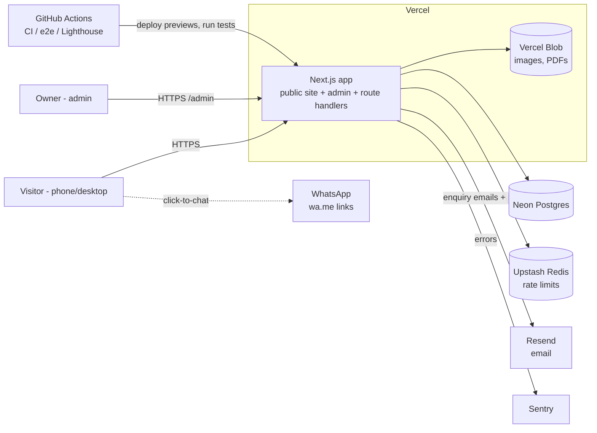
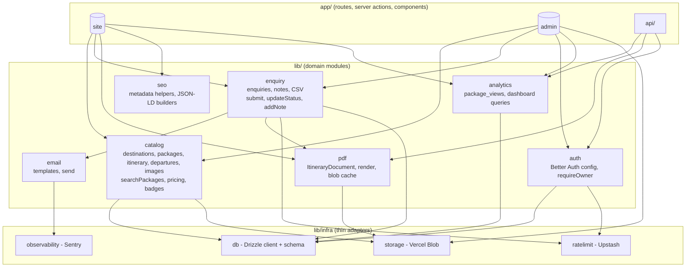

# Tripsmith — Architecture

**Lifecycle step:** 5 of 17 · **Written:** 2026-09-12
**Inputs:** [04-technical-design.md](04-technical-design.md), [04-technical-design-v2-v3.md](04-technical-design-v2-v3.md)
**Scope:** the v1 system, with the v2/v3 seams marked so they slot in without restructuring.

## 1. System context



External systems in v1: **five** (Neon, Blob, Upstash, Resend, Sentry), all free tier. v2 adds Razorpay; v3 adds one AI provider behind an abstraction; v4 adds no external system — it makes Tripsmith *itself* a service (MCP) that external assistants call.

## 2. One app, three faces

A single Next.js deployment serves three audiences with route groups; nothing is a separate service.

| Face | Route group | Who | Rendering |
|---|---|---|---|
| **Public site** | `app/(site)/` | visitors, crawlers | static + on-demand revalidation; listing dynamic |
| **Admin** | `app/(admin)/admin/` | owner | dynamic, authenticated |
| **Machine endpoints** | `app/api/`, `app/(site)/packages/[slug]/itinerary.pdf/` | browsers (beacon), crons, later webhooks and chat | route handlers |

## 3. Module boundaries (the `lib/` layer)

The rule: **routes and components never touch Drizzle directly.** They call a domain module in `lib/`, and each domain module owns its tables.



**Dependency rules**
- `app/*` → `lib/<domain>` only. Never `lib/infra` directly (except `auth` middleware).
- `lib/<domain>` → `lib/infra` and other domains **only downward**: `enquiry` may use `pdf` and `email`; `catalog` uses nothing but infra. No cycles.
- `lib/infra` → third-party SDKs. This is the only place a vendor SDK is imported (`drizzle-orm`, `@vercel/blob`, `@upstash/ratelimit`, `@sentry/nextjs`, `resend`). Swapping a vendor touches one file.
- Domain modules return **plain objects** (no Drizzle row classes) so results can be cached, serialised to client components, and later handed to the AI tools unchanged.

## 4. Folder layout

```
tripsmith/
├─ app/
│  ├─ (site)/                 public pages: page.tsx, destinations/, packages/, about/, contact/, enquiry/thanks, policies
│  │  └─ packages/[slug]/
│  │     ├─ page.tsx
│  │     ├─ opengraph-image.tsx
│  │     └─ itinerary.pdf/route.ts
│  ├─ (admin)/admin/          login/, page.tsx (dashboard), destinations/, packages/, enquiries/
│  ├─ api/                    view/route.ts (edge), upload/route.ts, cron/pdf-gc/route.ts
│  ├─ sitemap.ts · robots.ts · layout.tsx · not-found.tsx
├─ components/
│  ├─ ui/                     shadcn primitives
│  ├─ site/                   Hero, SearchBox, PackageCard, FilterBar, ItineraryDay, DeparturesTable, EnquiryForm, WhatsAppButton…
│  ├─ admin/                  PackageForm, ItineraryEditor, GalleryUploader, EnquiryTable…
│  └─ seo/                    JsonLd components
├─ lib/
│  ├─ catalog/ · enquiry/ · pdf/ · email/ · auth/ · analytics/ · seo/ · validation/
│  └─ infra/                  db/ (schema.ts, client.ts, migrations/), ratelimit.ts, storage.ts, observability.ts
├─ content/                   destinations/*.ts, packages/*.ts, testimonials.ts, policies/*.md
├─ emails/                    react-email templates
├─ scripts/                   seed.ts
├─ tests/                     unit/ (vitest), e2e/ (playwright)
├─ public/                    seed images, fonts, favicon
└─ .github/workflows/         ci.yml, e2e.yml, lighthouse.yml
```

## 5. Key flows

### 5.1 Visitor reads a package page
```
GET /packages/goa-north-beaches
  → static HTML from Vercel CDN (built via generateStaticParams)
  → client: <ViewBeacon> fires sendBeacon('/api/view') once per session
        → edge handler → lib/analytics.recordView → Neon upsert
```

### 5.2 Visitor filters the listing
```
GET /packages?destination=goa&nights=3-4&month=2026-11
  → server component parses searchParams → lib/catalog.searchPackages(params)
  → unstable_cache(tag: 'packages') → Drizzle query → cards
  → FilterBar (client) updates the URL via router.replace; server re-renders the list
```

### 5.3 Enquiry (the money flow of v1)
```mermaid
sequenceDiagram
  participant B as Browser
  participant A as submitEnquiry (server action)
  participant RL as ratelimit
  participant DB as Neon
  participant P as lib/pdf
  participant M as Resend
  B->>A: form (name, phone, …, packageSlug, honeypot)
  A->>A: zod validate, honeypot check
  A->>RL: 5/10min per IP
  A->>DB: dedupe (phone+package <60s) → insert enquiry (status=new)
  A->>P: render or fetch cached itinerary PDF
  A->>M: owner notification + customer confirmation (PDF attached)
  Note over A,M: email failure → Sentry + enquiry.email_status='failed'; never blocks
  A-->>B: redirect /enquiry/thanks?ref=…
```

### 5.4 Owner edits a package
```
POST server action updatePackage(id, data)
  → requireOwner() → zod validate → lib/catalog.updatePackage (transaction: package + days + departures + images)
  → revalidateTag('packages'); revalidatePath('/packages/[slug]'); revalidatePath('/destinations/[destSlug]')
  → updatedAt changes → next PDF request renders a fresh file (old one GC'd weekly)
```

### 5.5 Image upload
```
Admin <GalleryUploader> → server action getUploadToken() (requireOwner, validates type/size)
  → browser uploads directly to Vercel Blob with the token
  → server action attachImage(packageId, url, position) → Neon
```

## 6. Deployment topology

| Environment | Branch | URL | Data |
|---|---|---|---|
| **Local** | any | `localhost:3000` | Neon dev branch (or local Postgres via Docker), Blob dev store, Resend test key |
| **Preview** (step 14 staging) | every PR | `tripsmith-git-<branch>.vercel.app` | Neon branch per PR (created by CI, seeded, deleted on close); Playwright + Lighthouse run here |
| **Production** | `main` | `tripsmith.virajdomadia.com` | Neon `main` branch |

- Vercel project `tripsmith`, framework preset Next.js, Node 22, region `bom1` (Mumbai) to sit next to the Indian audience; Neon project in the closest region (Singapore).
- Secrets live only in Vercel env (production / preview / development scopes) and GitHub Actions secrets; `.env.example` documents names, never values.
- Crons: `vercel.json` → `/api/cron/pdf-gc` weekly (Hobby allows daily-granularity crons).

## 7. Cross-cutting concerns

| Concern | Where |
|---|---|
| Auth | `middleware.ts` gates `/admin/*`; `lib/auth.requireOwner()` inside every admin server action |
| Validation | `lib/validation/*.ts` zod schemas shared by client forms and server actions |
| Rate limiting | `lib/infra/ratelimit.ts` — `limit(key, n, window)`; used by enquiry, login (v1), chat (v3) |
| Errors | Server actions return `{ ok: false, fieldErrors | message }`; unexpected errors → Sentry + generic message; `error.tsx` boundaries per route group |
| Caching | Tag `packages` for all catalog reads; `revalidateTag` on every catalog mutation |
| Observability | Sentry client/server/edge; Vercel Analytics; UptimeRobot on `/` |
| Content | Seed content is code (`content/`), reviewed like code; the DB is the runtime source of truth after seeding |

## 8. v2 / v3 seams (already accounted for)

| Later piece | Slots into |
|---|---|
| `lib/booking` (quote, holds, state machine), `lib/payments` (Razorpay adapter in `lib/infra/razorpay.ts`), `app/api/webhooks/razorpay` | new domain modules + one infra adapter; `catalog` unchanged |
| `lib/ai` (provider, tools, guardrails), `app/api/chat`, `components/site/Concierge` | tools call `catalog.searchPackages`, `booking.quote`, `enquiry.submit` — existing domain functions, no new data paths |
| v4 `app/api/mcp` (MCP server) | imports the same `lib/ai/tools.ts` definitions as the chat route; resources read `lib/catalog`; one new table `mcp_requests` |
| Customer accounts | Better Auth already present; `users.role` column exists from v1 |
| Add-ons (storyboard, best-time strip, trip hub, split pay) | read `itinerary_days.location`, `climate[]`, `booking` — all designed in v1/v2 schema |

## 9. What this architecture deliberately avoids
- No separate API service, no monorepo, no microservices — one deployable.
- No client-side data fetching library (SWR/React Query) — server components + server actions cover v1; v3 chat uses the AI SDK's own hook.
- No ORM-level abstraction beyond Drizzle — SQL is visible and testable.
- No feature flags system — versions ship as releases, not toggles.
