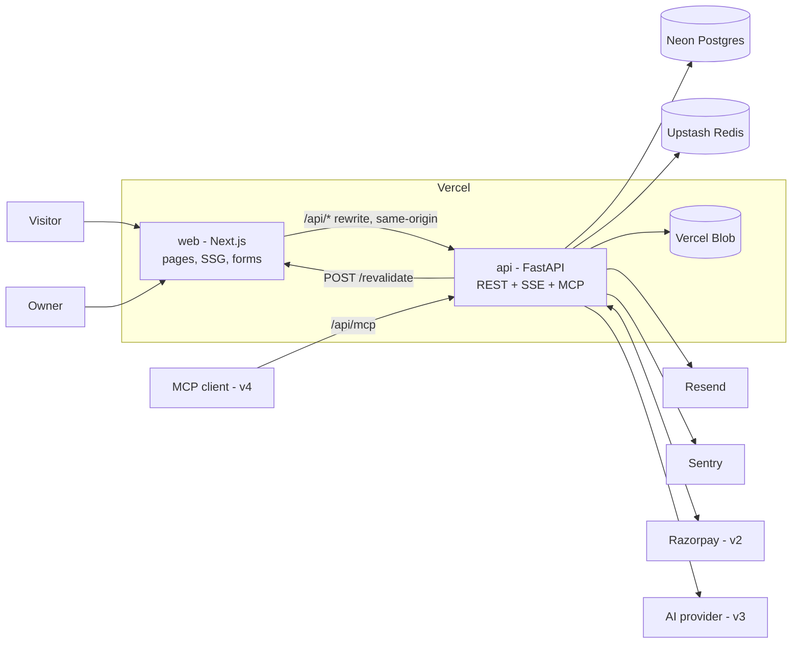
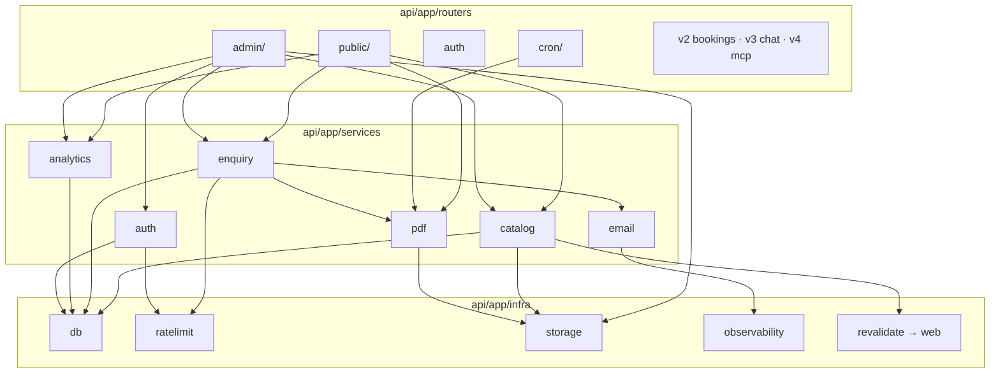
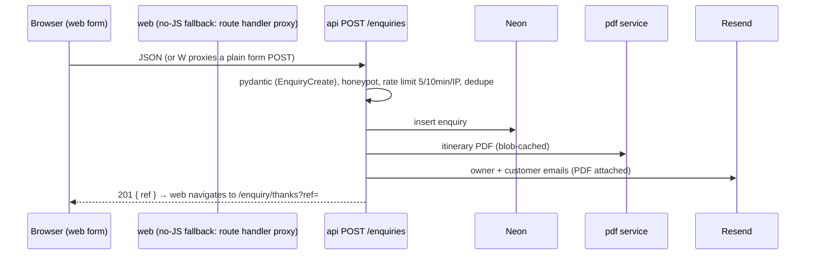

# Tripsmith — Architecture

**Lifecycle step:** 5 of 17 · **Written:** 2026-09-12 · **Revised:** 2026-09-12 for the separate `web/` + `api/` layout · **Revised:** 2026-09-13 — backend switched from Hono to FastAPI
**Inputs:** [04-technical-design.md](04-technical-design.md), [04-technical-design-v2-v3.md](04-technical-design-v2-v3.md)
**Scope:** the whole product; v2/v3/v4 seams marked.

## 0. The split (applies to all six portfolio projects)
Two deployables in one repo, two languages, one generated contract:

| Folder | What | Owns | Deployed as |
|---|---|---|---|
| **`web/`** | Next.js App Router — UI only (TypeScript, pnpm) | pages, components, SEO, forms (as thin clients), static generation | Vercel project `tripsmith` → `tripsmith.virajdomadia.com` |
| **`api/`** | FastAPI (Python 3.12, uv) REST API | database, auth, business logic, PDF, email, uploads, payments, AI, MCP, crons, webhooks | Vercel project `tripsmith-api` (Vercel FastAPI preset, one function, Fluid compute, `bom1`) → `api.tripsmith.virajdomadia.com` |
| **contract** | `api/openapi.json` (generated from the FastAPI app, committed) → `web/src/lib/api-types.ts` (generated by `openapi-typescript`, committed) | request/response types, enums (themes, badges, statuses), error envelope | neither — CI fails if either file is stale; runtime constants via `GET /meta` |

`web/` **never** imports SQLAlchemy or touches the database. It talks to `api/` over HTTP through a same-origin rewrite (`/api/*` → the API deployment), so cookies are first-party and there is no CORS. Everything designed in steps 4 and 6 as a "server action" becomes an API endpoint; `web/` keeps only trivial route handlers (revalidation hook, OG images, sitemap). There is no `shared/` package: the pydantic models in `api/app/schemas/` are the single source of the contract, and the only duplicated validation is a small zod mirror for the enquiry form (04 §3).

## 1. System context


## 2. Repo layout (pnpm for `web/`, uv for `api/`)
```
tripsmith/
├─ web/                              Next.js (pnpm)
│  ├─ src/app/
│  │  ├─ (site)/                     home, destinations/, packages/, about/, contact/, enquiry/thanks, policies
│  │  ├─ (admin)/admin/              login/, dashboard, destinations/, packages/, enquiries/  (v2: bookings/, v3: conversations/)
│  │  ├─ (account)/account/          v2
│  │  ├─ developers/                 v4
│  │  ├─ revalidate/route.ts         POST from api with secret → revalidateTag/Path
│  │  ├─ sitemap.ts · robots.ts · opengraph-image routes
│  ├─ src/components/  ui/ · site/ · admin/ · seo/ · concierge/ (v3: useConcierge hook + panel)
│  ├─ src/lib/  api.ts (typed fetch over api-types.ts, cookies forwarded) · api-types.ts (GENERATED, pnpm gen:api) · seo/
│  ├─ tests/                         vitest (api client, zod mirror) · e2e/ Playwright
│  └─ next.config.ts                 rewrites: /api/:path* → API_URL/:path*
├─ api/                              FastAPI (uv; Python 3.12)
│  ├─ app/
│  │  ├─ main.py                     `app = FastAPI(...)`: app factory, middleware (sentry, request id), routers, error handlers, lifespan (lazy engine)
│  │  ├─ config.py                   pydantic-settings: every env var in 04 §12
│  │  ├─ errors.py                   ApiError + exception handlers → { error: { code, message, fieldErrors? } }
│  │  ├─ openapi.py                  `python -m app.openapi` dumps the OpenAPI document → api/openapi.json
│  │  ├─ routers/
│  │  │  ├─ public/                  health.py, meta.py, catalog.py, enquiries.py, pdf.py, views.py
│  │  │  ├─ admin/                   destinations.py, packages.py, images.py (multipart proxy upload), enquiries.py, dashboard.py
│  │  │  ├─ auth.py                  POST /auth/login · POST /auth/logout · GET /auth/session  (v2: /auth/otp/*)
│  │  │  ├─ cron/                    pdf_gc.py (v3: departure_alerts, v2 add-on: share_reminders)
│  │  │  ├─ account.py · bookings.py · webhooks.py (razorpay)   v2
│  │  │  ├─ chat.py (SSE) · alerts.py                            v3
│  │  │  └─ mcp.py (mounts the FastMCP app at /mcp)              v4
│  │  ├─ services/                   catalog/ enquiry/ pdf/ email/ (templates/) auth/ analytics/  (v2 booking/ payments/, v3 ai/, v4 mcp/)
│  │  ├─ infra/                      db.py (engine, session dependency), ratelimit.py (Upstash REST), storage.py (Blob REST), observability.py (sentry), revalidate.py (→ web)
│  │  ├─ models/                     SQLAlchemy 2.0 declarative models, one module per table group
│  │  └─ schemas/                    pydantic v2 request/response models — the API contract (+ meta.py constants)
│  ├─ alembic/ + alembic.ini         revisions 0001_v1, 0002_v2, 0003_v3, 0004_v4
│  ├─ content/                       seed content: packages/*.py, destinations/*.py, testimonials.py (define_package, typed pydantic content models) · photos/ (+ CREDITS.md)
│  ├─ assets/fonts/                  DM Sans TTF for fpdf2
│  ├─ scripts/seed.py                upsert by slug; --local skips Blob
│  ├─ tests/                         pytest + pytest-asyncio + httpx AsyncClient; DB tests on TEST_DATABASE_URL
│  ├─ evals/                         v3: scripted conversations against the real provider (pytest -m evals, nightly)
│  ├─ openapi.json                   GENERATED, committed — the contract web/ builds its types from
│  ├─ pyproject.toml · uv.lock · vercel.json (functions.app/main.py.maxDuration = 30, region bom1)
├─ docs/ · mockups/ · brand/
├─ package.json                      root scripts fan out: lint / typecheck / test / dev (concurrently) / gen:api
├─ pnpm-workspace.yaml               web/ only
└─ .github/workflows/                ci.yml (jobs web · api · contract), e2e.yml, lighthouse.yml
```

## 3. Module boundaries inside `api/`
The rule from before still holds, one level down: **routers never touch SQLAlchemy sessions beyond dependency injection; they call services; services own their tables; infra is the only place a vendor SDK is imported.**


- Services return pydantic models from `app/schemas` (never ORM instances) — the same shapes FastAPI serialises, `web/` renders through the generated types, and the v3 tools return.
- Routers declare pydantic request/response models; FastAPI validates and generates the OpenAPI document from them. `RequestValidationError` is mapped in `errors.py` to the `validation` envelope with `fieldErrors` keyed by field path.

## 4. Auth across the split
- **Own session auth runs in `api/`** (`services/auth`, `routers/auth.py`): `users` + `sessions` tables, argon2 password hashes, opaque session token in an HttpOnly `SameSite=Lax` cookie. The cookie is set on the site origin because `web/` proxies `/api/*` → API; the browser never sees a second origin.
- `web/` posts to `/api/auth/login` / `/api/auth/logout` from the login page and calls `GET /api/auth/session` (server-side fetch forwarding cookies) in `middleware.ts` to gate `/admin/*` (v2: `/account/*`).
- `api/` enforces authorization itself on every protected route through the `require_owner` (v2 `require_user`) dependencies — the web gate is UX only.

## 5. Key flows (revised)

### 5.1 Static package page
```
build: web generateStaticParams → GET /api/packages?status=live (slugs)
request: web page.tsx → fetch(`${API}/packages/${slug}`, { next: { tags: ['packages', `package:${slug}`] } }) → render
client: <ViewBeacon> → POST /api/views { slug }
```

### 5.2 Listing with filters
```
web /packages?… → fetch /api/packages?destination=&maxBudget=&nights=&theme=&month=&sort= (tag 'packages') → cards
FilterBar updates the URL; web re-renders; API query is the single search_packages() implementation
```

### 5.3 Enquiry


### 5.4 Owner edits a package (revalidation across the split)
```
web admin form → PUT /api/admin/packages/:id (cookie) → api: require_owner → tx → 200
api → POST {WEB_URL}/revalidate { secret, tags: ['packages', 'package:slug', 'destination:slug'] }
web /revalidate → revalidateTag(...) → next request rebuilds the static page
api: updated_at changed → next itinerary.pdf request renders a fresh file
```

### 5.5 Image upload (server-side proxy)
```
web GalleryUploader → POST /api/admin/packages/:id/images (multipart: file, position; owner)
  → api: type + size (≤ 5 MB) check → Pillow: dimensions, resize to ≤ 2000 px → infra/storage.py PUT to Blob (REST) → package_images row → 201 { id, url, width, height, position }
```

### 5.6 v3 chat (SSE across the split)
```
web Concierge (useConcierge hook: fetch POST /api/chat, reads the SSE stream) → rewrite → api POST /chat (sse-starlette EventSourceResponse over a pydantic-ai run_stream) → named events back through the rewrite
```

### 5.7 v4 MCP
```
MCP client → POST https://api.tripsmith.virajdomadia.com/mcp (direct, no rewrite) → FastMCP app mounted at /mcp (Streamable HTTP, stateless) → same tool functions as chat (services/ai/tools.py)
```

## 6. Deployment topology
| Environment | web | api | Data |
|---|---|---|---|
| Local | `localhost:3000` (rewrites → `localhost:8787`) | `localhost:8787` (`uv run uvicorn app.main:app --port 8787 --reload`; `pnpm dev` at the root starts both) | Neon dev branch (tests: local PostgreSQL 18 via `TEST_DATABASE_URL`) |
| Preview (step 14 staging) | Vercel preview per PR; `API_URL` = the api preview URL | Vercel preview per PR | Neon branch per PR, seeded by CI |
| Production | `tripsmith.virajdomadia.com` | `api.tripsmith.virajdomadia.com` | Neon `main` |

- Two Vercel projects from one repo (root directories `web/` and `api/`), both region `bom1`; Neon in Singapore. The api project uses Vercel's **FastAPI** preset: `api/app/main.py` exports `app`, one Vercel Function on Fluid compute, `api/vercel.json` sets `maxDuration 30` and the region.
- Crons live in the **api** project's `vercel.json`. Webhooks (v2) and MCP (v4) hit the api domain directly.
- Secrets split: `api/` holds all service keys; `web/` holds only `API_URL`, `REVALIDATE_SECRET`, `NEXT_PUBLIC_*`.

## 7. Cross-cutting
| Concern | Where |
|---|---|
| Validation | pydantic v2 models in `api/app/schemas/` — one request/response model per endpoint; web gets them as generated types (`api-types.ts`) and keeps one zod mirror for the enquiry form |
| OpenAPI | FastAPI built-in: `/openapi.json` + Swagger UI at `/docs` (ReDoc off) — a portfolio artifact in itself; `api/openapi.json` committed and diff-checked in CI |
| Errors | api returns `{ error: { code, message, fieldErrors? } }` with proper status (`errors.py` handlers, incl. `RequestValidationError` → `validation`); web maps to inline errors; unexpected → Sentry in both |
| Caching | web `fetch` tags + `/revalidate` hook; api sets `Cache-Control` on public GETs |
| Rate limiting | api `infra/ratelimit.py` (Upstash Redis REST, sliding window) as a FastAPI dependency per route |
| Observability | Sentry in both projects (`sentry-sdk[fastapi]` in api); Vercel Analytics on web; UptimeRobot on `/` and `/api/health` |
| Content | `api/content/` seed modules; DB is the runtime source of truth |

## 8. v2 / v3 / v4 seams
| Later piece | Slots into |
|---|---|
| v2 `services/booking`, `services/payments`, routers `account.py`, `bookings.py`, `webhooks.py` | api only; web adds `(account)` pages and the checkout UI calling the endpoints |
| v3 `services/ai` (provider, tools, guardrails), `routers/chat.py` (SSE) | api; web adds the Concierge component + `useConcierge` |
| v4 `services/mcp`, `routers/mcp.py` | api; imports the same `services/ai/tools.py`; web adds `/developers` |
| Add-ons | schema already carries their columns; each is a service + a page |

## 9. What this architecture deliberately avoids
- No shared source package across the boundary — the api is Python, the web is TypeScript (decided 2026-09-13). The cost is one generated-types step (`openapi.json` → `api-types.ts`, checked in CI) and a small zod mirror for the enquiry form; the gain is the Python ecosystem for AI, MCP and PDF and a second language in the portfolio.
- No GraphQL — REST + OpenAPI is enough and reads well in a portfolio.
- No microservices beyond the two deployables; no message queue (crons + lazy expiry cover every timed need).
- No client-state library — server components + a typed fetch client; the chat uses a small in-house `useConcierge` hook over the SSE stream.
