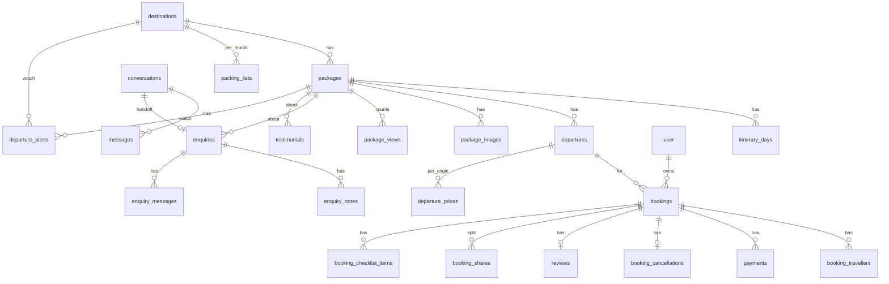

# Tripsmith — Database + API Design (whole app: v1, v2, v3, add-ons)

**Lifecycle step:** 6 of 17 · **Written:** 2026-09-12
**Inputs:** [03-requirements.md](03-requirements.md), [04-technical-design.md](04-technical-design.md), [04-technical-design-v2-v3.md](04-technical-design-v2-v3.md), [05-architecture.md](05-architecture.md)
**Scope:** every table and every endpoint the product will ever have, tagged with the version that introduces it. v1 builds only the v1-tagged tables **plus the forward-compat columns marked ⏩** (nullable, unused by v1 UI) so v2/v3 need no destructive migrations.

## Conventions
- IDs: `text` primary keys, cuid2 (`createId()`); human refs (`TS-7F3K2Q`) for enquiries and bookings.
- Money: **integer paise** (`_paise` suffix), INR only. Never floats.
- Time: `timestamptz`; departure dates are `date`.
- Slugs: `text unique`, lowercase-kebab, immutable after publish.
- Enums: Postgres enums via Drizzle `pgEnum`.
- Deletes: hard deletes only where nothing references the row; otherwise blocked in the domain layer.
- Every table: `created_at timestamptz default now()`, mutable tables also `updated_at`.

---

## Part A — Schema

### A1. Enums
| Enum | Values | Version |
|---|---|---|
| `user_role` | `owner`, `customer` | v1 (⏩ customer used in v2) |
| `package_status` | `draft`, `live` | v1 |
| `theme` | `beach`, `hills`, `honeymoon`, `family`, `adventure`, `heritage` | v1 |
| `occupancy` | `double`, `triple`, `single`, `child` | v1 (pricing) / v2 (travellers) |
| `enquiry_type` | `standard`, `custom`, `contact`, `callback`, `group`, `chat-handoff` | v1 (⏩ last three) |
| `enquiry_status` | `new`, `contacted`, `converted`, `closed` | v1 |
| `email_status` | `sent`, `failed`, `skipped` | v1 |
| `message_direction` | `outbound`, `inbound` | v2 |
| `booking_status` | `pending`, `confirmed`, `partially_paid`, `cancelled`, `completed` | v2 |
| `payment_provider` | `razorpay`, `offline` | v2 |
| `payment_status` | `created`, `captured`, `failed`, `refunded` | v2 |
| `cancellation_status` | `requested`, `approved`, `rejected` | v2 |
| `share_status` | `unpaid`, `paid`, `cancelled` | v2 add-on D |
| `conversation_outcome` | `open`, `booking_started`, `enquiry_created`, `dropped` | v3 |
| `message_role` | `user`, `assistant`, `tool`, `system` | v3 |

### A2. Auth (Better Auth managed) — v1
`user` (id, name, email unique, email_verified, image, **role user_role default 'customer'** ⏩, created_at, updated_at) · `session` · `account` · `verification`. The seed creates the single `role = 'owner'` row. v2's email-OTP plugin adds nothing to the schema.

### A3. Catalog — v1
**`destinations`**
| Column | Type | Notes |
|---|---|---|
| id | text PK | |
| slug | text unique | |
| name | text | "Goa" |
| tagline | text | one line |
| intro | text | 2–3 paragraphs, markdown |
| cover_url | text | Blob URL |
| region | text | "West India" |
| best_months | smallint[] | 1–12 |
| climate | jsonb | ⏩ add-on B: `[{month, rain, heat, crowd, price}]` × 12, each 1–3 |
| position | smallint | display order |
| created_at, updated_at | timestamptz | |

**`packages`**
| Column | Type | Notes |
|---|---|---|
| id | text PK | |
| slug | text unique | |
| destination_id | text FK → destinations (restrict) | |
| name | text | "North Goa Beaches" |
| summary | text | card blurb |
| themes | theme[] | GIN index |
| nights, days | smallint | days = nights + 1 enforced by check |
| departure_city | text | "Ex-Mumbai" default text; real per-origin pricing is add-on |
| highlights | text[] | 3–5 |
| inclusions, exclusions | text[] | |
| hotels | jsonb | `[{name, city, stars, nights}]` |
| faq | jsonb | `[{q, a}]` |
| cover_image_id | text FK → package_images (set null) | |
| status | package_status default 'draft' | |
| featured | boolean default false | home page |
| starting_price_paise | integer | **cached**: min live-departure `price_double_paise`; recomputed on departure writes |
| deal_price_paise | integer null | ⏩ v2 |
| deal_label | text null | ⏩ v2 |
| deal_ends_at | timestamptz null | ⏩ v2 |
| rating_avg | numeric(2,1) null | ⏩ v2 reviews |
| rating_count | integer default 0 | ⏩ v2 reviews |
| created_at, updated_at | timestamptz | `updated_at` keys the PDF cache |

Indexes: `(destination_id, status)`, `(status, featured)`, GIN on `themes`.

**`itinerary_days`** — id, package_id FK (cascade), day_no smallint, title, description (markdown), meals `{b,l,d}` as three booleans `meal_b/meal_l/meal_d`, stay text (hotel/city), **location_name, lat, lng** (⏩ all nullable, for storyboard / route map / weather), unique `(package_id, day_no)`.

**`departures`** — id, package_id FK (cascade), date `date`, seats_total smallint, guaranteed boolean default false, price_double_paise, price_triple_paise, price_child_paise, single_supplement_paise (all integer), whatsapp_group_url text null (⏩ add-on C), created_at, updated_at. Unique `(package_id, date)`; index `(date)`.

`seats_left` is **never stored**. It is computed by the view below.

**`departure_availability`** (SQL view, v1 definition uses only v1 tables; v2 migration replaces it):
```sql
-- v1
select d.id as departure_id, d.seats_total as seats_left from departures d;
-- v2 (replaces)
select d.id as departure_id,
       d.seats_total
       - coalesce(sum(case when b.status in ('confirmed','partially_paid','completed')
                             or (b.status = 'pending' and b.hold_expires_at > now())
                           then t.cnt else 0 end), 0) as seats_left
from departures d
left join bookings b on b.departure_id = d.id
left join (select booking_id, count(*) cnt from booking_travellers group by booking_id) t on t.booking_id = b.id
group by d.id, d.seats_total;
```
In v1 the admin can additionally set `seats_total` down to simulate "filling fast" for the demo.

**`package_images`** — id, package_id FK (cascade), url, alt, width, height, position smallint. Index `(package_id, position)`.

**`testimonials`** — id, name, city, text, rating smallint (1–5), package_id FK null (set null), position, created_at.

### A4. Enquiries — v1
**`enquiries`**
| Column | Type | Notes |
|---|---|---|
| id | text PK | |
| ref | text unique | `TS-XXXXXX` |
| type | enquiry_type | |
| package_id | text FK null (set null) | |
| name, phone, email | text | phone validated `^[6-9]\d{9}$` |
| travel_month | date null | first of month |
| adults, children | smallint | |
| message | text null | |
| preferred_dates | text null | custom |
| budget_paise | integer null | custom |
| changes | text null | custom: "what would you change" |
| preferred_time | text null | ⏩ callback |
| status | enquiry_status default 'new' | |
| email_status | email_status | |
| conversation_id | text FK null → conversations | ⏩ v3 handoff |
| ip_hash, user_agent | text | abuse tracing, hashed |
| created_at, updated_at | timestamptz | |

Indexes: `(status, created_at desc)`, `(package_id)`, `(phone, package_id, created_at)` for dedupe.

**`enquiry_notes`** — id, enquiry_id FK (cascade), body, created_at. Append-only.
**`enquiry_messages`** (v2) — id, enquiry_id FK (cascade), direction, subject, body, resend_id, sent_at.

### A5. Analytics — v1
**`package_views`** — package_id FK (cascade), day `date`, count integer. PK `(package_id, day)`; index `(day)`.

### A6. Bookings — v2
**`bookings`**
| Column | Type | Notes |
|---|---|---|
| id, ref | text | ref `TB-XXXXXX` |
| package_id, departure_id | FK (restrict) | |
| user_id | FK null → user | attached at checkout by email |
| status | booking_status default 'pending' | |
| hold_expires_at | timestamptz | 10 min; 48 h when `split` |
| contact_name, contact_phone, contact_email | text | snapshot |
| origin_city | text null | ⏩ departure-city add-on |
| quote | jsonb | breakdown snapshot: lines, deal, total |
| total_paise, paid_paise | integer | |
| split | boolean default false | add-on D |
| created_at, updated_at | timestamptz | |

Indexes: `(departure_id, status)`, `(user_id, created_at desc)`, `(status, hold_expires_at)`.

**`booking_travellers`** — id, booking_id FK (cascade), name, age smallint, occupancy.
**`payments`** — id, booking_id FK, share_id FK null (add-on D), provider, razorpay_order_id text, razorpay_payment_id text **unique null**, amount_paise, status, raw jsonb (last webhook payload), created_at, updated_at. Index `(razorpay_order_id)`.
**`booking_cancellations`** — id, booking_id FK unique, reason, status, refund_note, created_at, resolved_at.
**`reviews`** — id, booking_id FK **unique**, package_id FK, user_id FK, rating smallint (1–5), text, photo_url null, approved boolean default false, created_at. Index `(package_id, approved)`.

### A7. Concierge — v3
**`conversations`** — id, session_id text (cookie), user_id FK null, outcome default 'open', provider, model, message_count integer, first_user_message text (denormalised for the admin list), created_at, updated_at. Index `(created_at desc)`.
**`messages`** — id, conversation_id FK (cascade), role, parts jsonb (AI SDK message parts: text, tool-call, tool-result), tokens_in, tokens_out integer null, created_at. Index `(conversation_id, created_at)`.
**`departure_alerts`** — id, email, package_id FK null, destination_id FK null, token text unique (unsubscribe), created_at, unsubscribed_at null. Check: exactly one of package_id/destination_id.
**`ai_generations`** (add-on A audit) — id, kind (`package_draft` | `packing_list`), brief text, output jsonb, provider, model, created_at.

### A8. Add-on tables
| Table | Columns | Add-on |
|---|---|---|
| `booking_shares` | id, booking_id FK, name, email, amount_paise, token unique, status share_status, razorpay_order_id, paid_at, reminded_at | D split payment |
| `booking_checklist_items` | id, booking_id FK, label, done boolean, position | C trip hub |
| `packing_lists` | destination_id FK, month smallint, items jsonb, generated_at — PK `(destination_id, month)` | C trip hub |
| `departure_prices` | departure_id FK, origin_city, price_double/triple/child_paise, single_supplement_paise — PK `(departure_id, origin_city)` | departure-city pricing |

### A9. Entity relationship (whole app)


### A10. Migration plan
| Migration | Contents |
|---|---|
| `0001_v1` | enums (all v1 + ⏩ values), auth tables + role, catalog, enquiries, notes, views, `departure_availability` v1 view |
| `0002_v2` | booking enums, bookings, travellers, payments, cancellations, reviews, enquiry_messages; **replace** `departure_availability` view |
| `0003_v3` | conversations, messages, departure_alerts, ai_generations; FK `enquiries.conversation_id` becomes enforced |
| `0004+_addons` | one migration per add-on table group, only when built |

---

## Part B — Seed content shape (v1)
```ts
// content/packages/goa-north-beaches.ts
export default definePackage({
  slug: 'goa-north-beaches', destination: 'goa', name: 'North Goa Beaches',
  themes: ['beach', 'family'], nights: 3, departureCity: 'Ex-Mumbai',
  summary: '…', highlights: ['…'], inclusions: ['…'], exclusions: ['…'],
  hotels: [{ name: 'Lemon Tree Amarante', city: 'Candolim', stars: 4, nights: 3 }],
  itinerary: [{ day: 1, title: 'Arrive Goa · Candolim', description: '…', meals: 'D',
                stay: 'Candolim', location: { name: 'Candolim', lat: 15.518, lng: 73.762 } }, …],
  faq: [{ q: '…', a: '…' }],
  departures: [{ date: '2026-11-14', seatsTotal: 20, guaranteed: true,
                 priceDouble: 14999, priceTriple: 13999, priceChild: 8999, singleSupplement: 4500 }, …],
  images: ['goa/north-1.jpg', …],   // under public/seed
});
```
`definePackage` is a typed identity function whose type is derived from the Drizzle insert types, so a bad seed fails `tsc`. Prices in the seed are rupees for readability; the seed script converts to paise.

---

## Part C — API surface

### C0. Conventions
- **Reads** are plain async functions in `lib/<domain>` called from server components — no HTTP layer.
- **Writes** are server actions. Every action returns
  ```ts
  type ActionResult<T> = { ok: true; data: T } | { ok: false; message: string; fieldErrors?: Record<string, string> }
  ```
  Unexpected errors are captured by Sentry and surfaced as a generic message.
- **Route handlers** exist only for things that must be HTTP: files, beacons, crons, webhooks, streaming chat.
- All admin actions call `requireOwner()` first; all customer actions (v2) call `requireUser()`.
- Rate-limit keys: `enquiry:{ip}`, `login:{ip}`, `chat:{ip}:{day}`, `chat:global:{day}`.

### C1. Public reads — v1 (`lib/catalog`, `lib/analytics`)
| Function | Params | Returns |
|---|---|---|
| `searchPackages` | `{ destination?: string[]; maxBudget?: number; nightsMin?: number; nightsMax?: number; themes?: Theme[]; month?: 'YYYY-MM'; sort?: 'price-asc'\|'price-desc'\|'duration' }` | `{ items: PackageCard[]; total: number }` — `PackageCard = { slug, name, destination, nights, days, startingPricePaise, themes, coverUrl, highlights, badge }` |
| `getPackage` | `slug` | full package with days, departures (+ `seatsLeft`, `badge`), images, faq, related[3]; `null` if draft/missing |
| `listDestinations` | — | `{ slug, name, coverUrl, packageCount, startingPricePaise }[]` (only with ≥1 live package) |
| `getDestination` | `slug` | destination + its live `PackageCard[]` |
| `getHomeData` | — | featured destinations, featured packages, testimonials |
| `getDeparturesForMonth` | `packageSlug, 'YYYY-MM'` | departures with `seatsLeft` (used by the v3 tool too) |

### C2. Public writes — v1 (`app/(site)/.../actions.ts`)
| Action | Input (zod) | Effects | Result |
|---|---|---|---|
| `submitEnquiry` | `{ type: 'standard'\|'custom'\|'contact'; packageSlug?; name; phone; email; travelMonth?; adults; children; message?; preferredDates?; budget?; changes?; website: '' (honeypot) }` | rate-limit; dedupe; insert; PDF; two emails; Sentry on mail failure | `{ ref }` → redirect `/enquiry/thanks?ref=` |

### C3. Route handlers — v1
| Method + path | Runtime | Behaviour |
|---|---|---|
| `GET /packages/[slug]/itinerary.pdf` | node, `maxDuration 30` | 404 if draft; 302 to cached Blob PDF or render → store → 302 |
| `POST /api/view` | edge | body `{ slug }`; UA bot filter; upsert `package_views`; 204 |
| `POST /api/upload` | node | owner only; returns Blob client-upload token for `image/*` ≤ 5 MB |
| `GET /api/cron/pdf-gc` | node | `Authorization: Bearer CRON_SECRET`; delete Blob PDFs whose `updatedAt` key no longer matches |
| `GET /sitemap.xml`, `/robots.txt` | static | all live packages/destinations, static pages |
| `GET /packages/[slug]/opengraph-image`, `/destinations/[slug]/opengraph-image` | edge | `next/og` |

### C4. Admin actions — v1 (`app/(admin)/admin/**/actions.ts`)
| Action | Input | Notes |
|---|---|---|
| `createDestination` / `updateDestination` / `deleteDestination` | destination fields | delete blocked if packages exist |
| `createPackage` / `updatePackage` | all package fields incl. `days[]`, `departures[]`, `faq[]`, `hotels[]` | one transaction; recompute `starting_price_paise`; revalidate |
| `setPackageStatus` | `{ id, status }` | live requires ≥ 1 image, ≥ 1 departure, full itinerary |
| `duplicatePackage` | `{ id }` | copies everything as draft, slug `-copy`, name "(copy)" |
| `deletePackage` | `{ id }` | blocked if enquiries or bookings reference it |
| `attachImage` / `reorderImages` / `removeImage` / `setCover` | image ops | |
| `updateEnquiryStatus` | `{ id, status }` | |
| `addEnquiryNote` | `{ id, body }` | |
| `exportEnquiriesCsv` | current filter params | returns a Blob URL (short-lived) or streams CSV |
| `getDashboard` (read) | — | enquiries this week vs last, by status, top packages by enquiries/views (30 d), departures next 30 d with `seatsLeft` |

### C5. v2 — Booking
**Customer actions**
| Action | Input | Effects |
|---|---|---|
| `quoteBooking` (read) | `{ departureId, travellers: { occupancy, age? }[], originCity? }` | breakdown from server prices + deal; no side effects |
| `createBookingOrder` | quote input + contact `{ name, phone, email }` + `split?: boolean` | tx: lock departure → check `seats_left` → insert pending booking + travellers (hold 10 min / 48 h) → Razorpay order → `{ bookingRef, orderId, amountPaise, keyId }` |
| `confirmPayment` | `{ bookingRef, razorpayOrderId, razorpayPaymentId, razorpaySignature }` | verify HMAC → payment captured → booking confirmed (guarded) → voucher email |
| `requestCancellation` | `{ bookingRef, reason }` | insert cancellation `requested` |
| `submitReview` | `{ bookingRef, rating, text, photo? }` | only if booking `completed`; `approved=false` |
| `listMyBookings` (read) | — | bookings for `requireUser()` |

**Route handlers**
| Method + path | Behaviour |
|---|---|
| `POST /api/webhooks/razorpay` | raw body; verify `X-Razorpay-Signature`; `payment.captured` → same guarded confirm; `payment.failed` → payment failed (booking stays pending until hold expiry); always 200 after recording |
| `GET /account/bookings/[ref]/voucher.pdf` | owner-of-booking or admin; `VoucherDocument` via `lib/pdf`, Blob-cached by `updatedAt` |
| `GET /pay/[token]` (add-on D) | share pay page; creates the share's Razorpay order on demand |
| `GET /api/cron/share-reminders` (add-on D) | daily; email unpaid shares older than 24 h |

**Admin actions**: `listBookings` (read, filters), `markPaidOffline { bookingRef, amountPaise, note }` (inserts `offline` payment, confirms), `resolveCancellation { id, status, refundNote }`, `updateBookingStatus`, `replyToEnquiry { id, subject, body, attachPdf }` (Resend + `enquiry_messages`), `moderateReview { id, approved }`, `exportBookingsCsv`, deals fields inside `updatePackage`.

**Booking state guards** (single `UPDATE … WHERE status = $expected`):
`pending → confirmed` (payment captured, Σ paid ≥ total) · `pending → partially_paid` (split, some paid) · `partially_paid → confirmed` · `pending|partially_paid → cancelled` (expired or failed) · `confirmed → cancelled` (cancellation approved) · `confirmed → completed` (departure date < today, nightly cron or lazy on read).

### C6. v3 — Concierge
**`POST /api/chat`** (node, streaming) — body: AI SDK `{ messages, conversationId? }`. Steps: quotas (`chat:{ip}:{day}` ≤ 20, `chat:global:{day}` ≤ `CHAT_GLOBAL_DAILY_LIMIT`, ≤ 30 messages per conversation, ≤ 500 chars per user message) → load/create conversation → `streamText({ model: provider(), system, messages: trimmed, tools, maxSteps: 5 })` → persist user + assistant parts → post-turn guardrail (slugs/prices ⊆ tool results, else replace + force search) → stream. Over quota → `429 { reason }`; the UI shows the enquiry form.

**Tools (zod schemas)**
| Tool | Input | Calls | Output |
|---|---|---|---|
| `searchPackages` | `{ destination?: string; maxBudget?: number; nights?: number; theme?: Theme; month?: 'YYYY-MM' }` | `catalog.searchPackages` | ≤ 5 `PackageCard` |
| `checkAvailability` | `{ packageSlug: string; month?: 'YYYY-MM' }` | `catalog.getDeparturesForMonth` | `{ date, seatsLeft, priceDoublePaise, badge }[]` |
| `startBooking` | `{ departureId: string; adults: number; children: number }` | `booking.quoteBooking` | `{ checkoutUrl, totalPaise }` — URL `/packages/[slug]/book?departure=…&adults=…&children=…` |
| `createEnquiry` | `{ name; phone; packageSlug?; summary }` | `enquiry.submit` with `type: 'chat-handoff'`, transcript attached as the message | `{ ref }` |

**Other**
| Endpoint / action | Behaviour |
|---|---|
| `subscribeDepartureAlert { email, packageSlug? \| destinationSlug? }` | insert + confirmation email |
| `GET /alerts/unsubscribe/[token]` | sets `unsubscribed_at` |
| `GET /api/cron/departure-alerts` | daily; departures created in last 24 h → email matching subscribers |
| `listConversations` / `getConversation` (admin reads) | outcome, counts, transcript with tool calls |
| `generatePackageDraft { brief, destinationSlug }` (admin action, add-on A) | `generateObject(packageDraftSchema)` with the destination's live packages as style examples → returns draft JSON for the form; logs to `ai_generations`; never writes `packages` |

### C7. Add-on endpoints
| Add-on | Endpoints |
|---|---|
| B best-time strip | none — reads `destinations.climate` |
| C trip hub | `getTripHub { bookingRef }` (read: booking, checklist, packing list — generates via `generateObject` on first request per destination-month, weather from Open-Meteo when ≤ 16 days out), `toggleChecklistItem`, admin `setDefaultChecklist { packageId, items[] }`, `setWhatsAppGroup { departureId, url }` |
| D split payment | `createBookingOrder(split: true)` creates shares; `GET /pay/[token]`; `payShare` (client callback verify); `coverRemaining { bookingRef }`; cron above |
| E storyboard | none — reads `itinerary_days.location` |
| Departure-city pricing | `departure_prices` CRUD inside `updatePackage`; `quoteBooking(originCity)` |
| Blog | file-based MDX, no API |
| Compare / wishlist / recently viewed | client-only |

---

## Part D — Validation schemas (shared client/server, `lib/validation`)
- `enquirySchema`, `packageSchema` (with `itineraryDaySchema[]`, `departureSchema[]`, `faqSchema[]`, `hotelSchema[]`), `destinationSchema`, `imageSchema`, `loginSchema` — v1.
- `quoteSchema`, `bookingContactSchema`, `paymentCallbackSchema`, `cancellationSchema`, `reviewSchema` — v2.
- `chatMessageSchema`, tool input schemas, `packageDraftSchema`, `alertSchema` — v3.
Rules that matter: Indian mobile `^[6-9]\d{9}$`; slugs `^[a-z0-9-]+$`; `days === nights + 1`; departure `date >= today` on create; prices `int >= 0`; `adults >= 1`, `children >= 0`, `adults + children <= 12` per booking; themes ≤ 3 per package.

## Part E — Data lifecycle & privacy
- Enquiries and bookings are retained indefinitely (demo). `ip_hash` is SHA-256 with a server salt; user agents are truncated to 200 chars.
- The AI provider receives: the conversation text and tool results (package data). It never receives enquiry names/phones — `createEnquiry`'s inputs are collected by a form the tool triggers in the UI, not typed into the chat.
- Blob objects are public-read (images, PDFs are marketing material); vouchers (v2) are uploaded with `access: 'private'` and served through the authenticated route.
